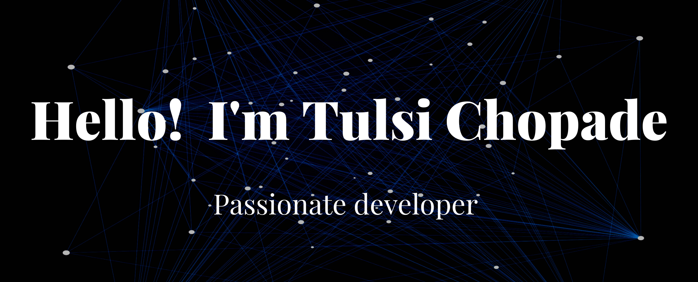

 

<h4 align="center"><b>I'm a self-taught passionate FrontEnd developer from India 🇮🇳</b></h4>

<h3 align="left">About me</h3>

- 🌱 I’m currently working on **Web Development and Problem Solving**

- 📫 Reach out me: **tulsichopade@gmail.com**

- 👯 I'm looking to collaborate on **Machine Learning Projects**

- ⚡ Fun fact **MSD fan and cricket lover!!**

 

<h3 align="left">Languages and Tools:</h3>

           
  
<h3 align="left">Connect with me:</h3>

  

<h3 align="left">Github Stats</h3>

&nbsp;

